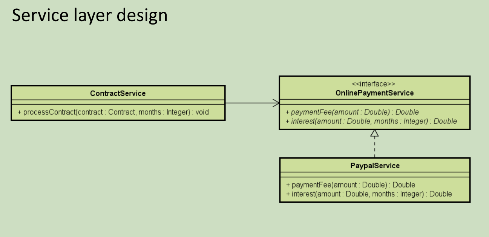

# Sistema de Processamentos de Contratos

É uma atividade do *Módulo 14* do curso de `C# Completo Programação Orientada a Objetos (POO)` Do professor `Nélio Alves`. 
Curso existente na plataforma [Udemy](https://www.udemy.com/course/programacao-orientada-a-objetos-csharp/).

* Implementar um sistema de processamento de contratos;
* Implementar e compreender sobre interfaces com C#;
* Inversão de Controle - Padrão de desenvolvimento que consiste em retirar da classe a
responsabilidade de instanciar suas dependências;
* Injeção de Dependência - É uma forma de realizar a inversão de controle: um componente externo
instancia a dependência, que é então injetada no objeto "pai". Pode ser implementada de várias formas (Construtor/ Objeto de instanciação/ Container/ Framework).

## Exercício

### Problemática:

### Exemplo para teste:

### Diagrama de Entidades:

### Diagrama de Serviços:

** Obs: Esse diagrama deve ser visto apenas se possuir dificuldade para implementar o sistema, já que em um caso real, não terá esse diagrama disponível, apenas as regras de negócio!

## Dados do Autor

Autor: `Matheus Glauber Rodrigues Jordão` [Linkedin](https://www.linkedin.com/in/matheusglauber/).
